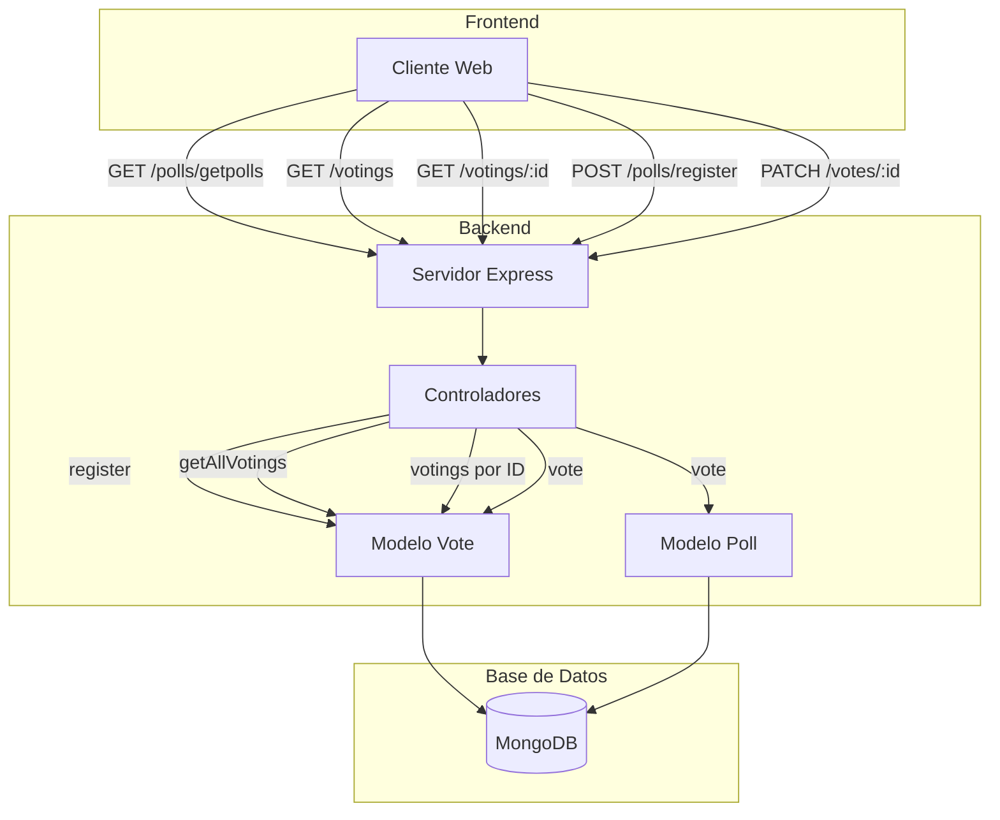

```mermaid
graph TD
    A[Cliente Web] -->|GET /polls/getpolls| B[Servidor Express]
    A -->|GET /votings| B
    A -->|GET /votings/:id| B
    A -->|POST /polls/register| B
    A -->|PATCH /votes/:id| B

    B --> C[Controladores]
    C -->|register| D[Modelo Vote]
    C -->|getAllVotings| D
    C -->|"votings por ID"| D
    C -->|vote| D
    C -->|vote| E[Modelo Poll]

    D --> F[(MongoDB)]
    E --> F

    subgraph Frontend
        A
    end

    subgraph Backend
        B
        C
        D
        E
    end

    subgraph Base de Datos
    F
    end
```
